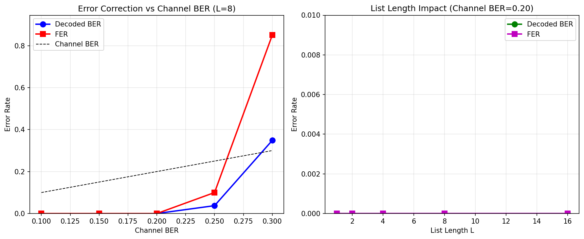

# polar-code-python

[English](README.md) | 简体中文

这是一个 5G NR Polar 编码核心流程的 Python 实现，当前仓库主要用于学习、实验、仿真和算法对照。

项目内容聚焦于：

- CRC 编码与校验
- Polar 码构造
- Polar 编码
- CRC 辅助的 SCL Polar 译码
- Polar rate matching / rate recovery
- BER / FER 仿真分析脚本

整体实现风格尽量贴近 MATLAB 版本和标准描述，便于和公式、流程图、3GPP 条文逐步对照。

## 标准参考

仓库中的实现和注释主要参考 5G NR 信道编码标准，尤其是：

- `3GPP TS 38.212, "3rd Generation Partnership Project; Technical
  Specification Group Radio Access Network; NR; Multiplexing and channel
  coding"`

源码中涉及的典型章节包括：

- Section 5.1：CRC 处理
- Section 5.3.1：Polar 编码总体流程
- Section 5.3.1.1：输入交织
- Section 5.3.1.2：Polar 码构造 / 可靠度序列
- Section 5.4.1.1：子块交织
- Section 5.4.1.2：rate matching 中的 bit selection
- Section 5.4.1.3：coded-bit interleaving

这个项目适合作为 3GPP Polar 编码流程的 Python 参考实现，但它不是一个经过认证的商用协议栈。

## 仓库结构

- `nrCRC.py`：NR 相关 CRC 编码与解码
- `utils.py`：辅助函数，例如可靠度序列、交织映射、构造函数等
- `nrPolarEncode.py`：Polar 编码器
- `nrPolarDecode.py`：CRC 辅助的 Polar 列表译码器
- `nrRateMatchAndRecoverPolar.py`：Polar rate matching 与 rate recovery
- `detailedPerformanceAnalysis.py`：性能分析脚本
- `polarAudioWatermarkSim.py`：面向 watermark / 信道鲁棒性的仿真脚本
- `requirements.txt`：Python 依赖列表

## 环境要求

- 推荐 Python 3.10+
- `numpy`
- `matplotlib`

安装依赖：

```bash
pip install -r requirements.txt
```

## 快速开始

### 1. CRC 示例

```python
import numpy as np
from nrCRC import nrCRCEncode, nrCRCDecode

msg = np.array([1, 0, 1, 1, 0, 1], dtype=int)
encoded = nrCRCEncode(msg, '11')
decoded, err = nrCRCDecode(encoded, '11')

print(encoded.shape)
print(decoded.flatten())
print(err)
```

### 2. Polar 编码 / 译码示例

```python
import numpy as np
from nrCRC import nrCRCEncode
from nrPolarEncode import nrPolarEncode
from nrPolarDecode import nrPolarDecode

K_info = 64
crc_len = 11
E = 128
L = 8
nMax = 10
iIL = False

info = np.random.randint(0, 2, K_info)
msg = nrCRCEncode(info, '11').flatten()
enc = nrPolarEncode(msg, E, nMax, iIL).astype(float)

# 理想信道 LLR
llr = (1 - 2 * enc) * 8.0
dec = nrPolarDecode(llr, len(msg), E, L, nMax, iIL, crc_len)

print(dec[:K_info])
```

### 3. 运行仓库自带脚本

```bash
python detailedPerformanceAnalysis.py
python polarAudioWatermarkSim.py
python testErrorCorrection.py
```

### 4. 纠错性能测试

`testErrorCorrection.py` 脚本展示了 Polar 码的纠错能力：



**测试结果 (K=64, CRC=11, E=512, 码率=0.125):**

测试1 - 信道BER影响 (L=8, 20帧):
- 信道BER 10%: 解码BER 0.00%, FER 0%
- 信道BER 15%: 解码BER 0.00%, FER 0%
- 信道BER 20%: 解码BER 0.00%, FER 0%
- 信道BER 25%: 解码BER 2.19%, FER 5%
- 信道BER 30%: 解码BER 39.45%, FER 90%

测试2 - 列表长度影响 (信道BER=20%, 20帧):
- L=1: 解码BER 2.81%, FER 10%
- L=2: 解码BER 0.00%, FER 0%
- L=4: 解码BER 0.00%, FER 0%
- L=8: 解码BER 0.00%, FER 0%
- L=16: 解码BER 0.00%, FER 0%

主要发现：
- 带CRC辅助SCL译码的Polar码在20%信道BER以下实现了优秀的纠错能力
- 列表长度L≥2相比L=1有显著性能提升
- 在当前码率下，超过25%信道BER后性能快速下降

## 模块说明

### `nrCRC.py`

提供：

- `nrCRCEncode`
- `nrCRCDecode`

支持的 CRC 标识包括：

- `'6'`
- `'11'`
- `'16'`
- `'24A'`
- `'24B'`
- `'24C'`

这里要特别区分：

- `nrCRCEncode` / `nrCRCDecode` 这个独立 CRC 模块支持上面全部标识。
- 但 Polar 流程并不是把这些 CRC 全都等价支持。
- `nrPolarDecode(..., crcLen)` 当前只接受 `6`、`11`、`24`。
- 在当前 Polar 译码实现里，`crcLen=24` 对应的是 `'24C'`。
- 所以 `'16'`、`'24A'`、`'24B'` 只是在独立 CRC 工具层可用，不是
  `nrPolarDecode` 的通用参数选项。

### `nrPolarEncode.py`

主要入口：

- `nrPolarEncode(inp, E)`：使用默认下行配置
- `nrPolarEncode(inp, E, nMax, iIL)`：显式指定参数

常见参数含义：

- `inp`：1D 二进制 NumPy 数组，通常已包含 CRC 比特
- `inp` 预期就是已经追加完 CRC 之后、送入 Polar 编码器的比特序列
- `E`：rate-matched 输出长度
- `nMax`：通常取 `9` 或 `10`
- `iIL`：输入交织开关

### `nrPolarDecode.py`

主要入口：

- `nrPolarDecode(inp, K, E, L)`
- `nrPolarDecode(inp, K, E, L, nMax, iIL, crcLen)`

常见参数含义：

- `inp`：1D 浮点 LLR 数组
- `K`：Polar 译码里的总消息长度，包含附加的 CRC 比特
- `E`：rate-matched 输出长度
- `L`：SCL 译码列表长度

例如，如果信息比特长度 `K_info=64`，CRC 长度为 `11`，那么 Polar
编码器/译码器这一层应使用 `K=75`。

### `nrRateMatchAndRecoverPolar.py`

提供：

- `nrRateMatchPolar`
- `nrRateRecoverPolar`

这两个函数实现了 NR Polar 流程中 rate matching 前后的交织与 bit selection 相关步骤。

## 验证命令

当前仓库还没有正式的自动化测试套件，但可以先使用下面这些命令做基础验证。

检查核心文件语法：

```bash
python -m py_compile utils.py nrCRC.py nrPolarEncode.py nrPolarDecode.py nrRateMatchAndRecoverPolar.py detailedPerformanceAnalysis.py polarAudioWatermarkSim.py
```

导入冒烟测试：

```bash
python -c "import nrCRC, nrPolarEncode, nrPolarDecode, nrRateMatchAndRecoverPolar, utils"
```

单文件语法检查：

```bash
python -m py_compile nrPolarDecode.py
```

CRC 快速检查：

```bash
python -c "import numpy as np; from nrCRC import nrCRCEncode; print(nrCRCEncode(np.array([1,0,1]), '11').shape)"
```

## 当前限制

- 目前还没有整理成可发布安装的 Python 包结构。
- 目前还没有正式的 `pytest` 自动化测试。
- 这个仓库主要用于实验、参考和算法理解，不是高性能生产实现。
- 某些函数仍然保留 MATLAB 风格的参数组织和流程结构，便于和标准或原始脚本逐步对照。

## 建议使用流程

1. 创建虚拟环境。
2. 安装 `requirements.txt` 中的依赖。
3. 先运行 CRC 和编码/译码的最小示例。
4. 再运行 `detailedPerformanceAnalysis.py` 观察基本性能。
5. 需要做更复杂信道实验时，再运行 `polarAudioWatermarkSim.py`。

## License

本项目采用 MIT License，详见 `LICENSE`。
